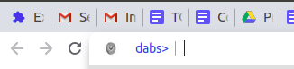

# DABS
Doug's Attempt at a Browser Shell

DABS was inspired by a desre to control the browser entirely with shell commands,
but it isn't quite correct ot think of it as a shell script like BASH. Rather, it's
more like the Vim command interface: where users enter commnds as shortcuts for common
tasks that would take too long to do using only the core functionality. However,
where vim focuses on commands that make editting text easier, DABS commands optimize
changing browser settings and browser navigation.



* [Installing DABS](installing-dabs)
* [Using DABS](#using-dabs)
* [Modifying DABS](#modifying-dabs)

## Installing DABS

Because DABS is a chrome extension, it will need to be installed from 
a manifest.json file as per the
[Chrome Developer Documentation](https://developer.chrome.com/extensions/external_extensions)

But before you go through all the trouble, why not configure DABS to
run the way you want it, without any of the extraneous junk?

In the top level of the documents there is a script called configure.sh
that will write a custom manifest.json for you.
Just list off the locations of all the module scripts you want to
include, then all of the permssions those scripts will need followed
by the `-p` flag.

If script configuration feels too daunting, there is also a Makefile
whose recipes will make some different configurations of DABS for you.


## Using DABS

DABS turns your browser's address bar into a shell input. Just start
entering textual commands into your browser preceeded by the command
character `;`. It's like Vim, but easier.

All DABS commands follow the format:
```
; <command-string> [param-strings]
```

For specifics on how to use different commands present in DABS,
consult the [module documentation](all-modules.md)


## Modifying DABS

DABS is licensed under the GNU GPL, so you're free to change whatever
you want so long as you share the source.

However, DABS is configured to be modular, so we hope you stick around
and keep the shell growing.

If you want to add new functionality to DABS in your own utility,
look at [Creating a DABS Module](#creating-a-dabs-module)

If you want to make contributions outside of module creation, look
at [Changing the DABS Core](#changing-the-dabs-core)

### Creating a DABS Module

Congratulations! You're writing your first DABS module. DABS' modular
behavior comes it being a uniquely configured chrome extension, and if
that statement confused you, then try brushing up on chrome extensions
as a prerequisite. You can find the Chrome developer docs
[here](https://developer.chrome.com/extensions/getstarted).

The DABS environment works by running a simple string parser that
has a registered list of modules that it knows to pass arguments to.
How the core works isn't important, what is important is that DABS
offers  no high level shell features. It's going to find your
function, pass it a lightly-parsed set of parameters, and lead the
rest up to you.

You can find a bare-minimum DABS module in
`templates/templatemodule.js`, here's a breakdown of what it does (and
what you'll need to do.

- Provide a module function. This is what will be executed when your
  command is run. It should accept one argument: a list of strings
  representing all the parameters the user wrote after the key for
  your module. It's up to you to handle these.
 ```
 function moduleFunc(params) {
   ...
   ...
   ...
 }
 ```
- Register the module with the DABS command line interpretter. Which
  is a long way of saying "cll the provided addModule function".
  addModule takes two arguments: the function object itself and a list
  of strings that represent commands that will cause that function to 
  be called.
  ```
  addModule(moduleFunc,
  [
    "moduleName"
  ]);
  ```

### Changing the DABS Core

If you're changing utility functions, updating the build scripts, or
doing pretty much anything outside of the `modules/` directory, then
your changes are much further reaching and and could affect all of the
modules in the DABS environment, so do be careful 007.

Generally, all of DABS will need to be tested from the ground up to
make sure supported modules stay supported and nothing on the fringe
breaks dramatically. To speed up the merging of your code, try to
include this in your PR:

* A description of what the expected behaviors from the change are
  (Including how they diverge from other changes).
* A description of why this shouldn't break existing functionality
  (backward compatability with other modules, a description of how you
  changed these modules, etc.)
* Recommendations for how to test this feature (i.e. how you've been
  testig it).
